<div align="center">


<br/>


<br/>

[](https://github.com/Satej-More)
[](https://x.com/@SatejMore260450)
[](https://github.com/Satej-More)

</div>

<br/>

---

## 🧬 Who Am I

```typescript
const satej: Developer = {
  alias       : "Satej-More",
  name        : "Satej More",
  location    : "/root 🌍",
  roles       : ["Full Stack Developer", "Spring Developer", "AI Enthusiast"],

  stack: {
    frontend  : ["React", "Next.js", "TypeScript", "Tailwind CSS"],
    backend   : ["Node.js", "Express", "Python", "REST APIs"],
    ai        : ["LangChain", "OpenAI API", "AI Agents", "LLMs"],
    languages : ["TypeScript", "JavaScript", "Python", "Spring boot", "Java", "C++"],
    databases : ["PostgreSQL", "MongoDB", "Redis"],
    tools     : ["Git", "Docker", "Linux", "VS Code"],
  },

  currentlyBuilding : "Spring Boot + AI-powered full stack systems 🚀",
  contact           : "https://x.com/@SatejMore260450",
};
```

---

## ⚡ Tech Arsenal

<div align="center">

### 🌐 Frontend


### 🔧 Backend


### 🗄️ Databases & Cloud


### 🤖 AI & ML


</div>

---

## 🚀 Featured Projects

<div align="center">

| 🏷️ Project | 📝 Description | 🔧 Stack | ⭐ |
|:----------|:--------------|:--------|:--|
| [🏦 ForgePLM](https://github.com/Satej-More/ForgePLM) |A full-stack production-grade industrial parts marketplace built for PLM workflows.| JavaScript | [](https://github.com/Satej-More/ForgePLM) |
| [📊 Sentinel](https://github.com/Satej-More/Sentinel) |Ultra-modern, high-throughput, distributed real-time fraud detection platform designed to protect high-velocity digital payment gateways. | SpringBoot | [](https://github.com/Satej-More/Sentinel) |
| [🔐 Anti-Cheat](https://github.com/Satej-More/Anti-Cheat) | An advanced AI-powered exam monitoring system with enhanced object detection capabilities. | Python | [](https://github.com/Satej-More/Anti-Cheat) |
| [✨ Morphues](https://github.com/Satej-More/morpheus) | Autonomous AI SRE agent that detects, investigates, and resolves production incidents using Dynatrace MCP, Gemini AI, and historical incident intelligence. | [](https://github.com/Satej-More/morpheus) |


</div>

---

## 📊 GitHub Stats

<div align="center">



</div>

---

## 🌐 Let's Connect

<div align="center">

[](https://x.com/@SatejMore260450)
&nbsp;
[](https://www.linkedin.com/in/satej-more-b0b0a5207)
&nbsp;
[](https://github.com/Satej-More)

<br/><br/>

*Less planning, more building. Less perfection, more progress.*

</div>


